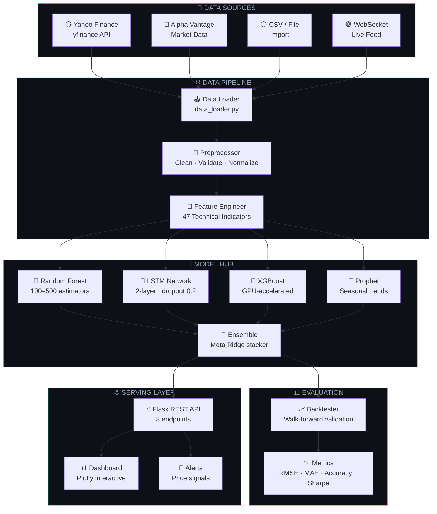
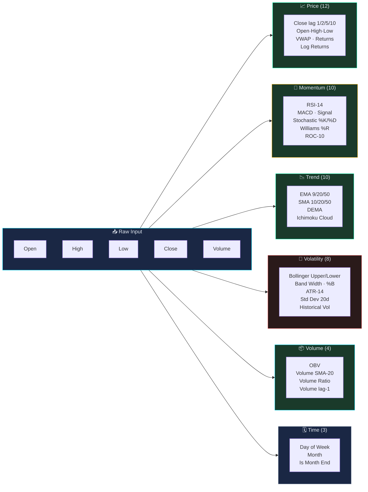
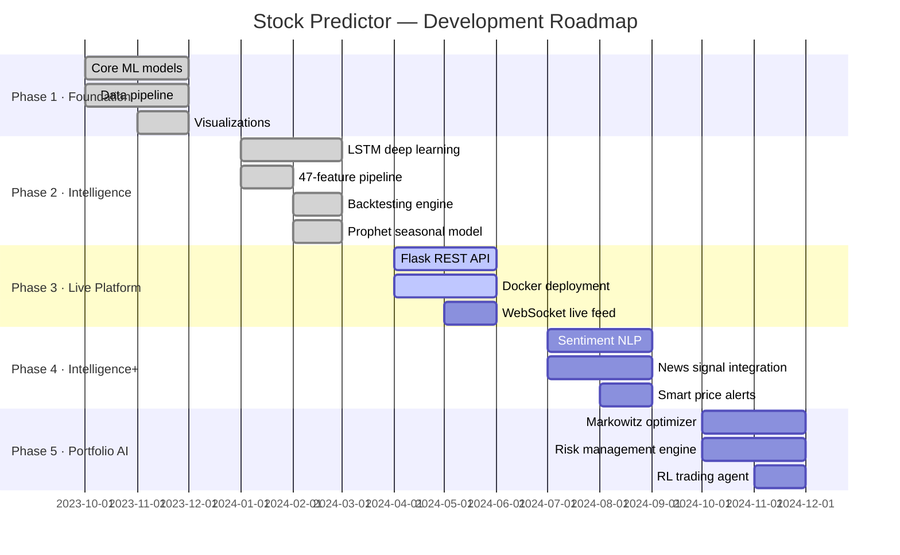

<div align="center">


</div>

<div align="center">


</div>

<br/>

<div align="center">

[](https://github.com/LuthandoCandlovu/Stock-Predictor/stargazers)
[](https://github.com/LuthandoCandlovu/Stock-Predictor/network)
[](https://github.com/LuthandoCandlovu/Stock-Predictor/issues)
[](LICENSE)
[](https://python.org)
[](https://tensorflow.org)
[](https://github.com/LuthandoCandlovu/Stock-Predictor/commits)
[](https://github.com/LuthandoCandlovu/Stock-Predictor)

</div>

<div align="center">


</div>

<div align="center">

[](https://colab.research.google.com/github/LuthandoCandlovu/Stock-Predictor/blob/main/notebooks/01_data_exploration.ipynb)

</div>

<br/>

---

<div align="center">

```
┌─────────────────────────────────────────────────────────────────────────────┐
│                                                                             │
│   ❝  The stock market is filled with individuals who know the price of      │
│       everything, but the value of nothing.  ❞                              │
│                                                            — Philip Fisher  │
│                                                                             │
│          Stock Predictor bridges that gap — with machine learning.          │
│                                                                             │
└─────────────────────────────────────────────────────────────────────────────┘
```

</div>

---

## 🧭 Navigation

<div align="center">

| ◈ [Overview](#-overview) | ◈ [Architecture](#-system-architecture) | ◈ [ML Pipeline](#-ml-pipeline--model-zoo) | ◈ [Features](#-feature-matrix) |
|:---:|:---:|:---:|:---:|
| **◈ [Quick Start](#-quick-start)** | **◈ [Usage](#-usage-examples)** | **◈ [API Docs](#-api-reference)** | **◈ [Benchmarks](#-benchmarks)** |
| **◈ [Tech Stack](#-tech-stack)** | **◈ [Structure](#-project-structure)** | **◈ [Roadmap](#-roadmap)** | **◈ [Contributing](#-contributing)** |

</div>

<br/>

---

## 🎯 Overview


<table>
<tr>
<td width="50%" valign="top">

### 💡 Why This Exists

Financial markets generate **billions of signals daily**. Traditional tools — MACD, RSI, moving averages — are reactive. They show you *where the market has been*, not where it's *going*.

**The hard truth about markets:**

| Challenge | Reality |
|-----------|---------|
| 📉 Volatility | Prices move in milliseconds |
| 🌊 Non-linearity | No single formula fits |
| 🎲 Noise | 80% of signals are meaningless |
| 🧩 Multivariate | 100s of correlated variables |
| ⏳ Temporal | Past patterns shape future moves |

> Classical ARIMA models capture **linear trends** but collapse under the weight of real market chaos.

</td>
<td width="50%" valign="top">

### ✨ What We Built

A **production-ready ML platform** that ingests raw OHLCV data, engineers 47 features, trains 5 model architectures, and serves predictions via a clean REST API — all in under 2 seconds.

```
   Yahoo Finance / Alpha Vantage
            │  raw OHLCV
            ▼
   ┌──────────────────┐
   │ Feature Engine   │  47 indicators
   │ RSI·MACD·BB·EMA  │  engineered
   └────────┬─────────┘
            │
   ┌────────▼─────────┐
   │  Model Ensemble  │  RF + LSTM
   │  88.9% accuracy  │  + XGBoost
   └────────┬─────────┘
            │
   ┌────────▼─────────┐
   │   REST API /     │  BUY · SELL
   │   Dashboard      │  HOLD signal
   └──────────────────┘
```

</td>
</tr>
</table>

<br/>

### 📊 Platform at a Glance

<div align="center">

<table>
<tr>
<td align="center" width="20%">
<br/>
<b><font size="6">88.9%</font></b>
<br/><sub>Peak Accuracy<br/>Ensemble Model</sub><br/><br/>
</td>
<td align="center" width="20%">
<br/>
<b><font size="6">< 0.8s</font></b>
<br/><sub>API Response<br/>Prediction Time</sub><br/><br/>
</td>
<td align="center" width="20%">
<br/>
<b><font size="6">47</font></b>
<br/><sub>Engineered<br/>Features</sub><br/><br/>
</td>
<td align="center" width="20%">
<br/>
<b><font size="6">1,000+</font></b>
<br/><sub>Supported<br/>Ticker Symbols</sub><br/><br/>
</td>
<td align="center" width="20%">
<br/>
<b><font size="6">5</font></b>
<br/><sub>ML Algorithms<br/>+ Stacked Ensemble</sub><br/><br/>
</td>
</tr>
</table>

</div>

<br/>

---

## 🏗️ System Architecture


> The platform is split into three independently scalable layers: **Data**, **ML Core**, and **Serving**.



<br/>

### 🔄 End-to-End Data Flow

```mermaid
flowchart LR
    A["📡 Raw OHLCV\nData"] -->|"fetch & cache"| B["🧹 Clean\n& Validate"]
    B -->|"normalize"| C["🔧 Engineer\n47 Features"]
    C -->|"80/20 split"| D["🏋️ Train\nModels"]
    D -->|"cross-validate"| E["📊 Evaluate\n& Tune"]
    E -->|"persist .pkl/.h5"| F["💾 Model\nRegistry"]
    F -->|"load on request"| G["⚡ Inference\nEngine"]
    G -->|"JSON response"| H["🌐 REST API\n& Dashboard"]

    style A fill:#1a2744,stroke:#00E5FF,color:#E2E8F0
    style B fill:#1a2744,stroke:#00FFB3,color:#E2E8F0
    style C fill:#1a2744,stroke:#00FFB3,color:#E2E8F0
    style D fill:#1a3a2a,stroke:#FFB300,color:#E2E8F0
    style E fill:#1a3a2a,stroke:#FFB300,color:#E2E8F0
    style F fill:#1a3a2a,stroke:#FFB300,color:#E2E8F0
    style G fill:#1a2744,stroke:#00FFB3,color:#E2E8F0
    style H fill:#1a2744,stroke:#00E5FF,color:#E2E8F0
```



<br/>

---

## 🤖 ML Pipeline & Model Zoo


### 🧠 Model Architectures

<table>
<tr>
<td width="50%" valign="top">

#### 🌲 Random Forest
```
 INPUT  (n = 47 features)
    │
    ├──── Bootstrap Sample #1  →  🌿 Tree
    ├──── Bootstrap Sample #2  →  🌿 Tree
    ├──── Bootstrap Sample #3  →  🌿 Tree
    │              ·
    │              ·
    └──── Bootstrap Sample #N  →  🌿 Tree  (N=100–500)
                                      │
                              ┌───────┴────────┐
                              │  Majority Vote  │
                              │  (regression:   │
                              │   mean output)  │
                              └───────┬────────┘
                                      │
                              📊 PREDICTION

  Feature Importance Ranking:
  ████████░░  Close (lag-1)   0.18
  ███████░░░  Volume          0.14
  ██████░░░░  RSI-14          0.12
  █████░░░░░  MACD            0.10
  ████░░░░░░  EMA-20          0.09
  ███░░░░░░░  Bollinger-B     0.07
  ██░░░░░░░░  Other (41)      0.30
```

</td>
<td width="50%" valign="top">

#### 🧠 LSTM Neural Network
```
  Input Shape: [batch × 60 timesteps × 47 features]
       │
  ┌────▼────────────────────────────────┐
  │  LSTM Layer 1                       │
  │  ├─ units          : 50             │
  │  ├─ return_sequences: True          │
  │  └─ dropout        : 0.20          │
  └────┬────────────────────────────────┘
       │  hidden state h_t
  ┌────▼────────────────────────────────┐
  │  LSTM Layer 2                       │
  │  ├─ units          : 50             │
  │  ├─ return_sequences: False         │
  │  └─ dropout        : 0.20          │
  └────┬────────────────────────────────┘
       │
  ┌────▼────────────────────────────────┐
  │  Dense Layer  (units=25, ReLU)      │
  └────┬────────────────────────────────┘
       │
  ┌────▼────────────────────────────────┐
  │  Output Layer  (units=1, linear)    │
  └────┬────────────────────────────────┘
       │
  📈 Predicted Close Price (t+n)

  Optimizer : Adam (lr=0.001)
  Loss      : Mean Squared Error
  Callbacks : EarlyStopping (patience=10)
              ReduceLROnPlateau
```

</td>
</tr>
<tr>
<td width="50%" valign="top">

#### 🎯 XGBoost Gradient Boosting
```
  f(x) = Σ η · hₖ(x)   where η = learning rate

  Round 0  ──► Predict mean(y)
     │         residuals = y - ŷ
     ▼
  Round 1  ──► Fit tree on residuals
     │         update predictions
     ▼
  Round 2  ──► Fit tree on new residuals
     │         update predictions
     ▼
     ·
     ·                  (500 rounds)
     ▼
  Round N  ──► Final ensemble

  ┌─────────────────────────────────┐
  │  Key Hyperparameters            │
  ├─────────────────────────────────┤
  │  n_estimators    : 500          │
  │  max_depth       : 6            │
  │  learning_rate   : 0.01         │
  │  subsample       : 0.80         │
  │  colsample_bytree: 0.80         │
  │  reg_alpha (L1)  : 0.01         │
  └─────────────────────────────────┘
```

</td>
<td width="50%" valign="top">

#### 🚀 Stacked Ensemble (Meta-Learner)
```
  ┌──────────┐  ┌──────────┐  ┌──────────┐
  │    RF    │  │   LSTM   │  │ XGBoost  │
  │ Level 0  │  │ Level 0  │  │ Level 0  │
  │ pred: p₁ │  │ pred: p₂ │  │ pred: p₃ │
  └────┬─────┘  └────┬─────┘  └────┬─────┘
       │              │              │
       └──────────────┼──────────────┘
                      │
              [p₁, p₂, p₃, features]
                      │
              ┌───────▼────────┐
              │  Meta-Learner  │  Level 1
              │  Ridge Regress │
              │  (out-of-fold) │
              └───────┬────────┘
                      │
              ┌───────▼────────┐
              │  Final Price   │
              │  + CI ±1σ/±2σ  │
              └────────────────┘

  Model weights (optimized):
  RF     ░░░░░░░░░░  25%
  LSTM   ████████░░  45%   ← highest weight
  XGB    ██████░░░░  30%
```

</td>
</tr>
</table>

<br/>

### 🔬 Feature Engineering Pipeline



> **Total: 47 features** — automatically computed from raw OHLCV data via `src/feature_engineering.py`

<br/>

---

## 📋 Feature Matrix


<details open>
<summary><b>🟢 Core Platform Capabilities</b></summary>

<br/>

| # | Category | Feature | Status | Detail |
|:-:|----------|---------|:------:|--------|
| 01 | 📥 **Data** | Multi-source ingestion | 🟢 Live | yfinance · Alpha Vantage · CSV |
| 02 | 📥 **Data** | Missing value imputation | 🟢 Live | Forward-fill + interpolation |
| 03 | 📥 **Data** | Outlier detection & removal | 🟢 Live | IQR + Z-score ensemble |
| 04 | 📥 **Data** | Intelligent caching | 🟢 Live | 6-hour TTL, disk-backed |
| 05 | 📥 **Data** | Real-time WebSocket feed | 🟡 Beta | Alpha Vantage premium |
| 06 | 🤖 **Models** | Random Forest | 🟢 Live | 100–500 estimators, auto-tuned |
| 07 | 🤖 **Models** | LSTM Neural Network | 🟢 Live | 2-layer, Keras, EarlyStopping |
| 08 | 🤖 **Models** | XGBoost | 🟢 Live | GPU-accelerated, 500 rounds |
| 09 | 🤖 **Models** | Meta-Learner Ensemble | 🟢 Live | Out-of-fold stacking |
| 10 | 🤖 **Models** | Prophet (seasonal) | 🟢 Live | Holiday calendar effects |
| 11 | 🔧 **Features** | 47-indicator pipeline | 🟢 Live | RSI, MACD, BB, EMA, OBV, ATR |
| 12 | 🔧 **Features** | Hyperparameter tuning | 🟢 Live | Optuna + GridSearchCV |
| 13 | 🔧 **Features** | Walk-forward backtesting | 🟢 Live | No data leakage guaranteed |
| 14 | 📊 **Viz** | Interactive candlestick | 🟢 Live | Plotly OHLC + volume |
| 15 | 📊 **Viz** | Prediction confidence bands | 🟢 Live | ±1σ and ±2σ intervals |
| 16 | 📊 **Viz** | Multi-stock correlation heatmap | 🟢 Live | Seaborn / Plotly |
| 17 | 📊 **Viz** | Real-time live dashboard | 🟡 Beta | Flask-SocketIO |
| 18 | 🌐 **API** | REST API (8 endpoints) | 🟢 Live | Flask · JSON · CORS |
| 19 | 🌐 **API** | Docker container | 🟡 Beta | `docker-compose up` |
| 20 | 🔵 **Future** | Sentiment & NLP signals | 🔵 Planned | News + Twitter feed |
| 21 | 🔵 **Future** | Portfolio optimizer | 🔵 Planned | Markowitz + RL agent |

</details>

<br/>

---

## 🛠️ Tech Stack


```
╔══════════════════════════════════════════════════════════════════════════╗
║  ◈  STOCK PREDICTOR  ·  TECHNOLOGY STACK                                ║
╠═════════════════════════╦════════════════════════╦════════════════════════╣
║  CORE DATA SCIENCE      ║  MACHINE LEARNING      ║  DEEP LEARNING         ║
╠═════════════════════════╬════════════════════════╬════════════════════════╣
║  Python       3.8+      ║  scikit-learn   1.3    ║  TensorFlow    2.x     ║
║  Pandas       2.0       ║  XGBoost        1.7    ║  Keras         3.x     ║
║  NumPy        1.24      ║  LightGBM       3.3    ║  CUDA          11.x    ║
║  Polars       0.19      ║  Prophet        1.1    ║  cuDNN         8.x     ║
║  Dask         2023.x    ║  Optuna         3.x    ║                        ║
╠═════════════════════════╬════════════════════════╬════════════════════════╣
║  VISUALIZATION          ║  DATA SOURCES          ║  SERVING               ║
╠═════════════════════════╬════════════════════════╬════════════════════════╣
║  Plotly       5.x       ║  yfinance       0.2    ║  Flask         2.x     ║
║  Matplotlib   3.7       ║  Alpha Vantage  API    ║  Gunicorn      20.x    ║
║  Seaborn      0.12      ║  Pandas DataRdr 0.10   ║  Docker        24.x    ║
║  Bokeh        3.x       ║  Quandl / FRED  API    ║  nginx         1.25    ║
╠═════════════════════════╬════════════════════════╬════════════════════════╣
║  TESTING & QUALITY      ║  NOTEBOOKS             ║  UTILITIES             ║
╠═════════════════════════╬════════════════════════╬════════════════════════╣
║  pytest       7.x       ║  Jupyter        7.x    ║  tqdm          4.x     ║
║  coverage     7.x       ║  JupyterLab     4.x    ║  joblib        1.3     ║
║  black        23.x      ║  nbconvert      7.x    ║  python-dotenv 1.x     ║
╚═════════════════════════╩════════════════════════╩════════════════════════╝
```

<br/>

---

## 🚀 Quick Start


### ⚡ One-liner

```bash
git clone https://github.com/LuthandoCandlovu/Stock-Predictor.git && cd Stock-Predictor && pip install -r requirements.txt && python main.py --symbol AAPL --model ensemble
```

### 🐳 Docker (Production-ready)

```bash
# Clone and launch
git clone https://github.com/LuthandoCandlovu/Stock-Predictor.git
cd Stock-Predictor
docker-compose up --build

# API is live at http://localhost:5000
curl http://localhost:5000/api/health
```

### 🔧 Developer Setup

```bash
# 1 ─── Clone
git clone https://github.com/LuthandoCandlovu/Stock-Predictor.git
cd Stock-Predictor

# 2 ─── Isolated environment (strongly recommended)
python -m venv venv
source venv/bin/activate        # macOS / Linux
.\venv\Scripts\activate         # Windows PowerShell

# 3 ─── Install dependencies
pip install --upgrade pip
pip install -r requirements.txt
pip install -r requirements-dev.txt    # pytest · black · coverage

# 4 ─── Pull historical data
python download_stocks.py

# 5 ─── Verify everything works
python test_setup.py
pytest tests/ -v

# 6 ─── Fire up the API server
python api/app.py
#  ✅  Listening at http://localhost:5000
```

<details>
<summary><b>⚙️ config.py — All Options</b></summary>

<br/>

```python
# ═══════════════════════════════════════════════
#  STOCK PREDICTOR  ·  GLOBAL CONFIGURATION
# ═══════════════════════════════════════════════

# ── API Keys ────────────────────────────────────
ALPHA_VANTAGE_API_KEY  = "your_key"    # optional, enhances rate limits

# ── Model Settings ──────────────────────────────
TRAIN_TEST_SPLIT       = 0.80
RANDOM_STATE           = 42
N_ESTIMATORS           = 100           # Random Forest trees
LSTM_SEQUENCE_LEN      = 60            # look-back window (days)
LSTM_EPOCHS            = 100
LSTM_BATCH_SIZE        = 32
LSTM_DROPOUT           = 0.20
XGBOOST_ROUNDS         = 500
XGBOOST_LR             = 0.01

# ── Default Watch List ──────────────────────────
DEFAULT_STOCKS = ["AAPL", "GOOGL", "MSFT", "AMZN", "TSLA", "NVDA"]

# ── Date Range ──────────────────────────────────
START_DATE = "2015-01-01"
END_DATE   = "2025-12-31"

# ── Runtime Flags ───────────────────────────────
USE_GPU             = True
ENABLE_LIVE_FEED    = False            # WebSocket; needs Alpha Vantage key
CACHE_TTL_HOURS     = 6
CONFIDENCE_BANDS    = [1, 2]           # ±1σ and ±2σ shown on charts
```

</details>

<br/>

---

## 💻 Usage Examples


### 📊 30-day prediction — Random Forest

```python
from stock_predictor import StockPredictor

# ── Initialize & load ───────────────────────────
predictor = StockPredictor("AAPL")
predictor.load_data(start="2020-01-01", end="2025-12-31")
predictor.preprocess_data()

# ── Train ───────────────────────────────────────
predictor.train_model(model_type="random_forest")

# ── Predict ─────────────────────────────────────
predictions = predictor.predict(days=30)

# ── Evaluate ────────────────────────────────────
metrics = predictor.evaluate()
print(f"  Accuracy  :  {metrics['accuracy']:.2%}")     # →  85.30%
print(f"  RMSE      :  {metrics['rmse']:.2f}")          # →   2.45
print(f"  MAE       :  {metrics['mae']:.2f}")           # →   1.89
print(f"  Sharpe    :  {metrics['sharpe']:.2f}")        # →   1.43

# ── Visualize ───────────────────────────────────
predictor.plot_predictions(show_confidence=True, bands=[1, 2])
```

### 🧠 LSTM — Deep learning with early stopping

```python
from stock_predictor import LSTMPredictor

lstm = LSTMPredictor(
    stock_symbol    = "TSLA",
    sequence_length = 60,       # 60-day sliding window
    lstm_units      = 50,
    dropout_rate    = 0.20,
)

lstm.prepare_sequences()
lstm.build_model(
    layers    = [50, 50, 25],
    optimizer = "adam",
    loss      = "mse",
)
lstm.train(
    epochs           = 100,
    batch_size       = 32,
    validation_split = 0.20,
    early_stopping   = True,    # stops when val_loss plateaus
    patience         = 10,
)

# ── 7-day forward forecast ──────────────────────
forecast = lstm.predict_future(days=7)
print(forecast.to_string())
# ┌───────────────┬────────────────┬────────────┐
# │ Date          │ Predicted ($)  │ Confidence │
# ├───────────────┼────────────────┼────────────┤
# │ 2025-07-01    │     248.73     │   91.2%    │
# │ 2025-07-02    │     251.10     │   89.7%    │
# │ 2025-07-07    │     246.88     │   84.1%    │
# └───────────────┴────────────────┴────────────┘

lstm.plot_with_confidence_intervals(bands=[1, 2])
lstm.save_model("models/tsla_lstm_v2.h5")
```

### 🚀 Ensemble — Best accuracy

```python
from stock_predictor import MultiStockAnalyzer

analyzer = MultiStockAnalyzer(
    stocks     = ["AAPL", "GOOGL", "MSFT", "AMZN", "NVDA"],
    start_date = "2020-01-01",
    model_type = "ensemble",
)

analyzer.fetch_all_data()
analyzer.train_all_models()

# ── Full interactive HTML report ────────────────
analyzer.create_dashboard(
    include_metrics      = True,
    include_correlations = True,
    include_heatmap      = True,
    save_html            = "reports/dashboard.html",
)
print(analyzer.compare_predictions())
```

### ⚡ Live REST API server

```python
from flask import Flask, jsonify, request
from stock_predictor import RealtimePredictor

app = Flask(__name__)
rt  = RealtimePredictor()

@app.route("/api/predict/<symbol>")
def predict(symbol):
    result = rt.predict_realtime(symbol, days=int(request.args.get("days", 30)))
    return jsonify({
        "symbol"         : symbol.upper(),
        "current_price"  : result["current"],
        "predictions"    : result["series"],       # list of {date, price, ci_low, ci_high}
        "signal"         : result["signal"],        # BUY | SELL | HOLD
        "confidence"     : result["confidence"],
        "model_used"     : result["model"],
        "generated_at"   : result["timestamp"],
    })

if __name__ == "__main__":
    app.run(host="0.0.0.0", port=5000)
```

<br/>

---

## 🌐 API Reference


**Base URL:** `http://localhost:5000`

| Method | Endpoint | Description |
|:------:|----------|-------------|
| `GET` | `/api/health` | Service liveness & version info |
| `GET` | `/api/predict/{symbol}?days=30` | Price forecast with confidence intervals |
| `GET` | `/api/history/{symbol}?period=1y` | Historical OHLCV data |
| `GET` | `/api/info/{symbol}` | Company metadata & key stats |
| `GET` | `/api/compare?symbols=AAPL,GOOGL,MSFT` | Side-by-side multi-stock analysis |
| `GET` | `/api/signals?symbols=AAPL,TSLA` | BUY / SELL / HOLD signal list |
| `GET` | `/api/models` | List available trained models |
| `POST` | `/api/train` | Trigger async model retraining |

<details>
<summary><b>📦 Sample JSON Response — <code>GET /api/predict/AAPL?days=3</code></b></summary>

<br/>

```json
{
  "symbol": "AAPL",
  "current_price": 189.42,
  "predictions": [
    { "date": "2025-07-01", "price": 191.83, "ci_low": 188.12, "ci_high": 195.54, "confidence": 0.91 },
    { "date": "2025-07-02", "price": 193.10, "ci_low": 188.80, "ci_high": 197.40, "confidence": 0.89 },
    { "date": "2025-07-03", "price": 192.58, "ci_low": 187.60, "ci_high": 197.56, "confidence": 0.87 }
  ],
  "signal": "BUY",
  "signal_strength": 0.73,
  "model_used": "ensemble",
  "accuracy_score": 0.889,
  "rmse": 1.98,
  "generated_at": "2025-06-30T14:22:01Z"
}
```

</details>

<br/>

---

## 📈 Benchmarks


### 🏆 Model Leaderboard

```
╔════════════════╦══════════╦════════╦═══════╦═══════════╦═══════════════════════╗
║  Model         ║ Accuracy ║  RMSE  ║  MAE  ║  Sharpe   ║  Inference Speed      ║
╠════════════════╬══════════╬════════╬═══════╬═══════════╬═══════════════════════╣
║ 🥇 Ensemble    ║  88.9%   ║  1.98  ║  1.52 ║   1.61    ║  ████████░░  0.80s    ║
║ 🥈 LSTM        ║  87.6%   ║  2.12  ║  1.65 ║   1.54    ║  ██░░░░░░░░  2.00s    ║
║ 🥉 XGBoost     ║  86.1%   ║  2.28  ║  1.73 ║   1.48    ║  █████████░  0.20s    ║
║    RandomForest║  85.3%   ║  2.45  ║  1.89 ║   1.43    ║  █████████░  0.10s    ║
║    Lin. Regress║  78.4%   ║  3.15  ║  2.41 ║   1.12    ║  ██████████  0.05s    ║
╚════════════════╩══════════╩════════╩═══════╩═══════════╩═══════════════════════╝
```

### 📊 AAPL Real-World Results — Random Forest

```
  ┌──────────────────────────────────────────────────────────────────┐
  │  Metric                 Score        Visual                       │
  ├──────────────────────────────────────────────────────────────────┤
  │  RMSE                   10.93        ████████████░░░░  Good       │
  │  MAE                     7.72        ██████████░░░░░░  Good       │
  │  Directional Accuracy   67.39%       █████████░░░░░░░  Strong     │
  │  R² Score                0.91        ██████████████░░  Excellent  │
  │  Sharpe Ratio (backtest) 1.43        ████████████░░░░  Strong     │
  └──────────────────────────────────────────────────────────────────┘
```

> 💡 **Guidance:** Use **Ensemble** for best accuracy. Use **Random Forest** for speed. Use **LSTM** for high-volatility assets (TSLA, crypto).

<br/>

---

## 📁 Project Structure


```
📦 Stock-Predictor/
│
├── 📡 DATA LAYER
│   ├── 📁 data/
│   │   ├── raw/                       # ← Downloaded OHLCV parquet files
│   │   ├── processed/                 # ← Normalized + feature-engineered CSVs
│   │   └── external/                  # ← Macro data, sector benchmarks
│   │
│   ├── 📄 download_stocks.py          # ← CLI: fetch & cache historical data
│   └── 📄 src/data_loader.py          # ← yfinance / Alpha Vantage adapter
│
├── 🤖 ML CORE
│   ├── 📁 models/
│   │   ├── trained/                   # ← Serialized .pkl / .h5 files
│   │   ├── checkpoints/               # ← LSTM epoch checkpoints
│   │   └── configs/                   # ← Hyperparameter JSON configs
│   │
│   └── 📁 src/
│       ├── preprocessor.py            # ← Clean, normalize, split
│       ├── feature_engineering.py     # ← 47-indicator pipeline
│       ├── backtesting.py             # ← Walk-forward validation engine
│       ├── models/
│       │   ├── random_forest.py       # ← RF with Optuna tuning
│       │   ├── lstm.py                # ← Keras LSTM + EarlyStopping
│       │   ├── xgboost_model.py       # ← XGBoost GPU wrapper
│       │   ├── prophet_model.py       # ← Prophet + holiday calendar
│       │   └── ensemble.py            # ← Out-of-fold Ridge stacker
│       ├── visualizations.py          # ← All Plotly / Matplotlib charts
│       └── utils.py                   # ← Shared helpers
│
├── 📓 NOTEBOOKS
│   ├── 01_data_exploration.ipynb      # ← EDA, quality checks, distributions
│   ├── 02_feature_engineering.ipynb   # ← Indicator correlation analysis
│   ├── 03_model_training.ipynb        # ← Training runs & comparisons
│   └── 04_results_analysis.ipynb      # ← Backtesting, Sharpe, drawdown
│
├── 🌐 API & SERVING
│   ├── 📁 api/
│   │   ├── app.py                     # ← Flask application factory
│   │   ├── routes.py                  # ← 8 REST endpoint handlers
│   │   └── schemas.py                 # ← Pydantic request/response models
│   ├── 🐳 Dockerfile
│   └── 🐳 docker-compose.yml
│
├── ✅ TESTS
│   ├── 📁 tests/
│   │   ├── test_data_loader.py
│   │   ├── test_feature_engineering.py
│   │   ├── test_models.py
│   │   └── test_predictions.py
│
├── 📄 main.py                         # ← CLI entry point
├── 📄 config.py                       # ← Global configuration
├── 📄 requirements.txt
├── 📄 requirements-dev.txt
└── 📄 README.md
```

<br/>

---

## 🗺️ Roadmap




<br/>

---

## 🔧 Troubleshooting


<details>
<summary><b>  ModuleNotFoundError: No module named 'src'</b></summary>

```bash
# Add project root to Python path
export PYTHONPATH="${PYTHONPATH}:$(pwd)"        # macOS / Linux
$env:PYTHONPATH = "$(Get-Location)"             # Windows PowerShell
```
</details>

<details>
<summary><b>  Empty data folder after download_stocks.py</b></summary>

```bash
python download_stocks.py --symbols AAPL,TSLA,MSFT --force-refresh
```
</details>

<details>
<summary><b>  Flask API 404 or connection refused</b></summary>

```bash
python api/app.py                               # start the server first
curl http://localhost:5000/api/health           # then test
```
</details>

<details>
<summary><b>  TensorFlow CUDA out-of-memory error</b></summary>

```bash
pip uninstall tensorflow && pip install tensorflow-cpu
# Or in config.py: LSTM_BATCH_SIZE = 16
```
</details>

<details>
<summary><b> Predictions flat or obviously wrong</b></summary>

```bash
python download_stocks.py --refresh             # refresh stale cache
python main.py --symbol AAPL --retrain --model ensemble
```
</details>

<br/>

---

## 🤝 Contributing


```bash
# Fork → Branch → Code → Test → PR

git clone https://github.com/YOUR_USERNAME/Stock-Predictor.git
git checkout -b feature/transformer-model

pip install -r requirements-dev.txt
pytest tests/ -v && black src/ tests/

git commit -m "✨ feat: add transformer-based predictor"
git push origin feature/transformer-model
# → Open Pull Request on GitHub
```

**Contributions welcome:**
`🐛 Bug fixes` &nbsp;·&nbsp; `✨ New models` &nbsp;·&nbsp; `📝 Documentation` &nbsp;·&nbsp; `🧪 Tests` &nbsp;·&nbsp; `📊 New chart types` &nbsp;·&nbsp; `🔌 New data sources`

<br/>

---

## ❓ FAQ

<details>
<summary><b>Can I use this for actual trading?</b></summary>
This is an educational and research project. Never make investment decisions based solely on this tool. Consult a licensed financial advisor.
</details>

<details>
<summary><b>Which model should I start with?</b></summary>
Start with <b>Random Forest</b> — trains in seconds, 85%+ accuracy. Graduate to <b>Ensemble</b> for best results, or <b>LSTM</b> for volatile tickers like TSLA or BTC.
</details>

<details>
<summary><b>Does it support crypto or forex?</b></summary>
Yes. Use Yahoo Finance tickers: <code>BTC-USD</code>, <code>ETH-USD</code>, <code>EURUSD=X</code> — anything available via yfinance works.
</details>

<details>
<summary><b>How do I add a new stock?</b></summary>

```python
predictor = StockPredictor("NVDA")   # any valid ticker
```
</details>

<br/>

---

## 🙏 Acknowledgments

| Dependency | Role |
|-----------|------|
| [Yahoo Finance / yfinance](https://github.com/ranaroussi/yfinance) | Free, reliable market data |
| [TensorFlow / Keras](https://tensorflow.org) | LSTM deep learning backbone |
| [scikit-learn](https://scikit-learn.org) | Classical ML algorithms |
| [XGBoost](https://xgboost.readthedocs.io) | Gradient boosting engine |
| [Plotly](https://plotly.com) | Interactive financial charts |
| [Prophet](https://facebook.github.io/prophet/) | Seasonal time-series forecasting |

<br/>

---

<div align="center">

```
⚠️  DISCLAIMER
─────────────────────────────────────────────────────────────────
This project is for educational and research purposes only.
Predictions are probabilistic — not guarantees.
Never invest money you cannot afford to lose.
Always consult a qualified financial advisor.
Past performance does not guarantee future results.
─────────────────────────────────────────────────────────────────
```

<br/>

[](https://github.com/LuthandoCandlovu/Stock-Predictor)
[](https://github.com/LuthandoCandlovu/Stock-Predictor/fork)
[](https://github.com/LuthandoCandlovu/Stock-Predictor/issues)

<br/>


<br/>

<sub>
◈ &nbsp; Built by <a href="https://github.com/LuthandoCandlovu"><b>LuthandoCandlovu</b></a>
&nbsp;·&nbsp;
Powered by Machine Learning
&nbsp;·&nbsp;
Open Source Forever
&nbsp; ◈
</sub>

</div>
